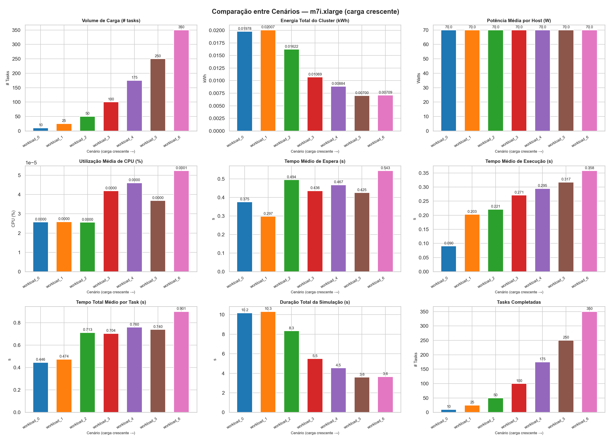
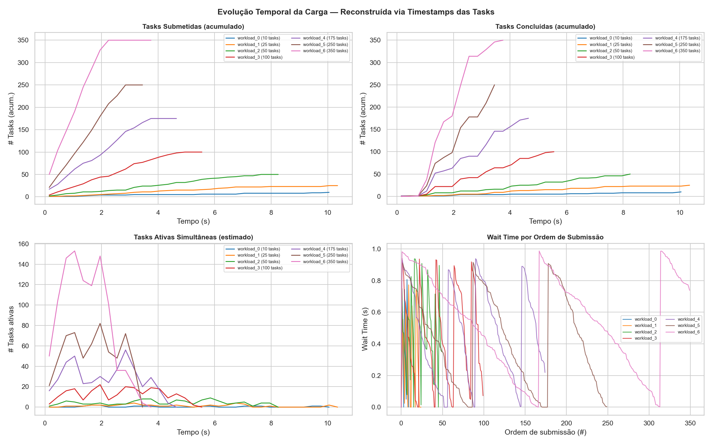
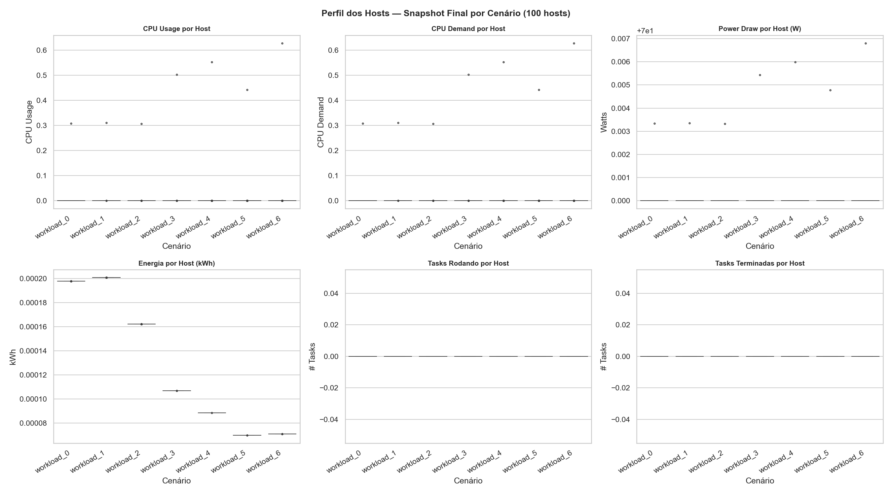
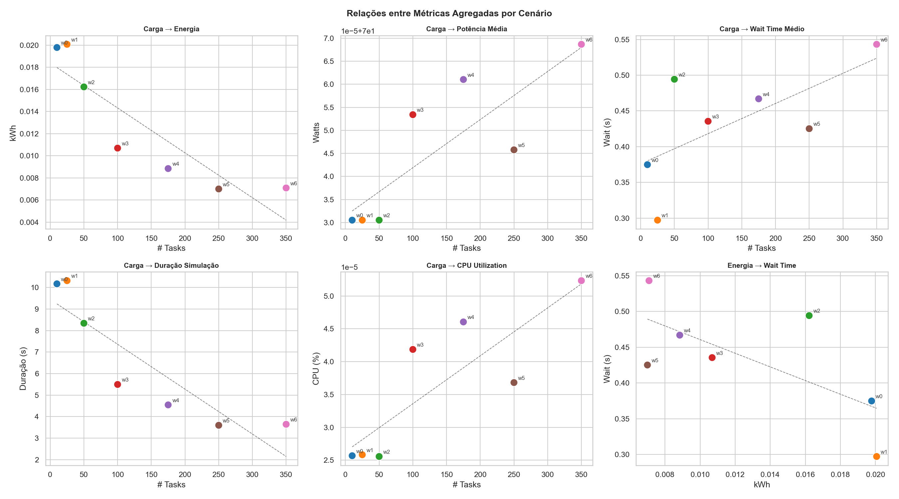
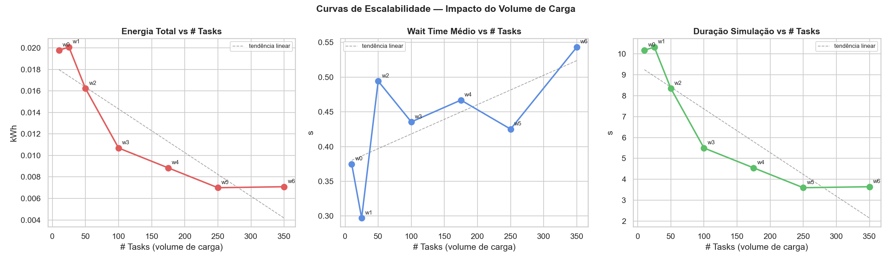
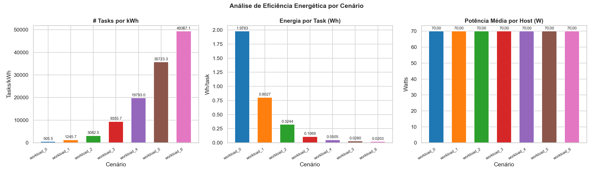
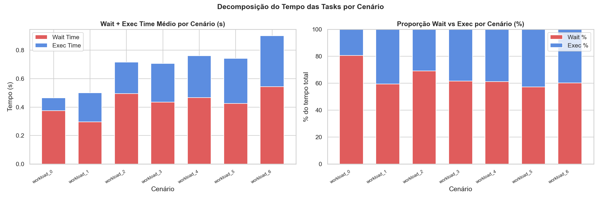
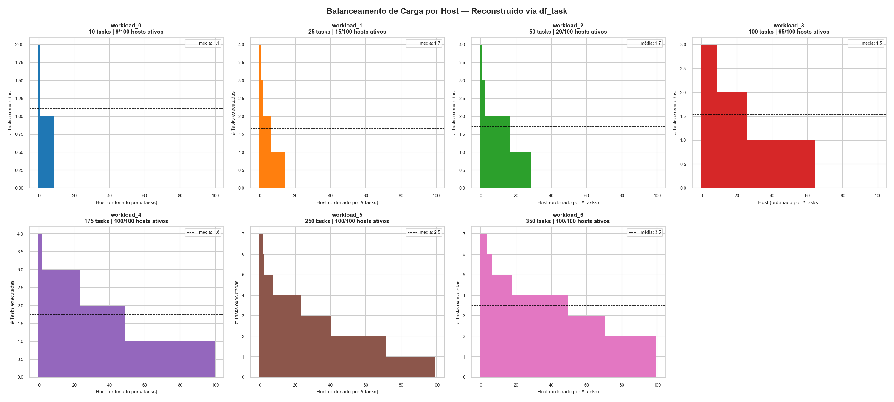
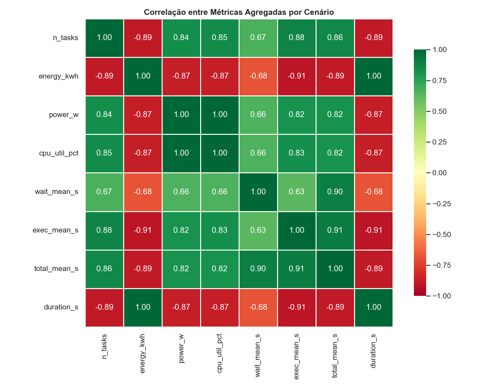

# Gêmeo Digital Adaptável ao Cliente para Monitoramento de Consumo de Recursos em Infraestrutura de Nuvem

## Integrantes

Rodrigo Hu Tchie Lee, Reginaldo Arakaki, Fabiana Martins de Oliveira

---

# Sumário

- [1. Objetivo do Documento](#1-objetivo-do-documento)
- [2. Contextualização do Projeto](#2-contextualização-do-projeto)
  - [2.1 Hipótese Central](#21-hipótese-central)
  - [2.2 Caso de Estudo: E-commerce de Porte Médio](#22-caso-de-estudo-e-commerce-de-porte-médio)
- [3. Definição da Topologia de Infraestrutura](#3-definição-da-topologia-de-infraestrutura)
  - [3.1 Seleção da Instância EC2](#31-seleção-da-instância-ec2)
  - [3.2 Modelagem no OpenDC](#32-modelagem-no-opendc)
- [4. Definição dos Cenários Operacionais](#4-definição-dos-cenários-operacionais)
  - [4.1 Critérios de Definição](#41-critérios-de-definição)
  - [4.2 Tabela de Cenários](#42-tabela-de-cenários)
- [5. Geração dos Workloads](#5-geração-dos-workloads)
  - [5.1 Formato de Entrada do OpenDC](#51-formato-de-entrada-do-opendc)
  - [5.2 Script de Geração](#52-script-de-geração)
  - [5.3 Bibliotecas Utilizadas](#53-bibliotecas-utilizadas)
- [6. Execução das Simulações no OpenDC](#6-execução-das-simulações-no-opendc)
  - [6.1 Configuração do Experimento](#61-configuração-do-experimento)
  - [6.2 Arquivos de Saída](#62-arquivos-de-saída)
  - [6.3 Resultados Consolidados](#63-resultados-consolidados)
- [7. Análise dos Dados Simulados](#7-análise-dos-dados-simulados)
  - [7.1 Estrutura do Notebook de Análise](#71-estrutura-do-notebook-de-análise)
  - [7.2 Limpeza e Padronização dos Dados](#72-limpeza-e-padronização-dos-dados)
  - [7.3 Tabela-Resumo por Cenário](#73-tabela-resumo-por-cenário)
  - [7.4 Comparação de Métricas Agregadas](#74-comparação-de-métricas-agregadas)
  - [7.5 Análise Temporal Reconstruída](#75-análise-temporal-reconstruída)
  - [7.6 Distribuições de Latência e Execução](#76-distribuições-de-latência-e-execução)
  - [7.7 Perfil dos Hosts](#77-perfil-dos-hosts)
  - [7.8 Relações entre Métricas](#78-relações-entre-métricas)
  - [7.9 Curvas de Escalabilidade](#79-curvas-de-escalabilidade)
  - [7.10 Análise de Eficiência Energética](#710-análise-de-eficiência-energética)
  - [7.11 Decomposição do Tempo das Tasks](#711-decomposição-do-tempo-das-tasks)
  - [7.12 Balanceamento de Carga por Host](#712-balanceamento-de-carga-por-host)
  - [7.13 Correlação entre Métricas](#713-correlação-entre-métricas)
  - [7.14 Métricas Derivadas e Dataset Final](#714-métricas-derivadas-e-dataset-final)
- [8. Uso de Modelos de Linguagem no Processo](#8-uso-de-modelos-de-linguagem-no-processo)
  - [8.1 Contexto Metodológico](#81-contexto-metodológico)
  - [8.2 Prompts Utilizados](#82-prompts-utilizados)
- [9. Limitações e Direções Futuras](#9-limitações-e-direções-futuras)
- [Referências](#referências)

---

## Pré-requisitos de Uso

Para reproduzir os artefatos deste projeto, recomenda-se o seguinte ambiente:

- Git 2.40 ou superior
- Python 3.10 ou superior
- Java 17 ou superior (requisito do simulador OpenDC)
- OpenDC (versão compatível com esquema JSON de topologia e entrada Parquet)
- Bibliotecas Python: `pandas`, `numpy`, `matplotlib`, `seaborn`, `pyarrow`, `boto3` (ou acesso à AWS Pricing API)
- Jupyter Notebook ou JupyterLab para execução do notebook de análise

---

# 1. Objetivo do Documento

Este documento descreve o processo de desenvolvimento, execução e análise do caso de estudo central do projeto de Iniciação Científica intitulado *Gêmeo Digital Adaptável ao Cliente para Monitoramento de Consumo de Recursos em Infraestrutura de Nuvem*, conduzido no Inteli — Instituto de Tecnologia e Liderança sob orientação do Prof. Reginaldo Arakaki e coorientação da Prof.ª Fabiana Martins de Oliveira.

O documento cobre desde a definição da topologia de infraestrutura simulada até a análise estatística e visual dos resultados obtidos, passando pela geração dos workloads, execução das simulações no OpenDC e preparação do dataset para as etapas subsequentes de modelagem preditiva. O registro é organizado de forma a permitir que um leitor sem conhecimento prévio do projeto compreenda cada decisão técnica tomada e reproduza os experimentos de forma independente.

---

# 2. Contextualização do Projeto

O projeto investiga a hipótese de que sistemas de monitoramento de infraestrutura de nuvem baseados em gêmeos digitais, quando configurados de forma adaptável às características operacionais e arquiteturais específicas de cada cliente, produzem resultados mais precisos e contextualmente relevantes do que abordagens genéricas. A premissa central é que ferramentas de monitoramento nativas de provedores de nuvem — como AWS CloudWatch e Azure Monitor — operam com parâmetros universais que geram alertas excessivos e dificultam a identificação de ineficiências reais, pois carecem de conhecimento sobre a arquitetura, as prioridades estratégicas e os padrões operacionais específicos de cada organização.

A abordagem proposta estrutura a adaptabilidade como variável central do sistema: o gêmeo digital é configurável segundo perfis de uso, prioridades estratégicas e padrões arquiteturais do cliente, permitindo que thresholds, modelos de custo e regras de análise reflitam o contexto particular de cada organização.

O projeto adota a norma ISO/IEC 25010 como referência para avaliação de qualidade de software, em particular as características de adequação funcional, confiabilidade e manutenibilidade, que orientam os critérios de avaliação do protótipo. A arquitetura distribuída do sistema segue os princípios do modelo de referência ISO/IEC 10746 (Open Distributed Processing), que estabelece os fundamentos para especificação de sistemas distribuídos em múltiplas viewpoints — organizacional, informacional, computacional, de engenharia e tecnológica.

## 2.1 Hipótese Central

A hipótese orientadora do projeto pode ser enunciada da seguinte forma: sistemas de gêmeos digitais adaptáveis às características específicas do cliente permitem monitoramento mais eficiente de recursos em nuvem, por meio de avaliação contínua da arquitetura e alinhamento com prioridades operacionais, resultando em identificação mais precisa de ineficiências e em otimização contextualizada dos recursos.

A validação experimental dessa hipótese requer, como passo inicial, a construção de uma base empírica de dados de simulação que represente com fidelidade os padrões de consumo de um cliente real. É esse o propósito do caso de estudo descrito neste documento.

## 2.2 Caso de Estudo: E-commerce de Porte Médio

O cliente modelado neste projeto é uma empresa fictícia de varejo eletrônico denominada *E-Shop Brasil*, concebida para representar um e-commerce de porte médio com alta dependência de infraestrutura de nuvem. A escolha deste perfil de cliente justifica-se por três características que tornam o problema de monitoramento adaptável especialmente relevante:

**Alta variabilidade de carga.** O e-commerce apresenta padrões de tráfego com variação significativa ao longo do dia e do calendário comercial, incluindo períodos de tráfego mínimo na madrugada e picos extremos em eventos como Black Friday e Cyber Monday. Essa variabilidade exige que o sistema de monitoramento seja capaz de distinguir entre regimes operacionais distintos e calibrar seus alertas de acordo com o contexto de carga esperado para cada período.

**Sensibilidade a custos operacionais.** Empresas de médio porte operam com margens mais sensíveis à ineficiência de infraestrutura do que grandes corporações. O desperdício de recursos computacionais — instâncias superdimensionadas, volumes não utilizados, hosts ociosos — representa impacto direto na viabilidade operacional. Um gêmeo digital adaptável capaz de identificar e quantificar essas ineficiências com precisão contextual tem, neste perfil, seu maior potencial de valor.

**Padrões arquiteturais estabelecidos.** O e-commerce de porte médio opera, em geral, sobre arquiteturas bem documentadas na literatura e na indústria, o que facilita a especificação do modelo de adaptabilidade e torna os resultados comparáveis a benchmarks existentes.

---

# 3. Definição da Topologia de Infraestrutura

## 3.1 Seleção da Instância EC2

A definição da topologia de infraestrutura a ser simulada partiu da identificação da instância Amazon EC2 mais adequada ao perfil do e-commerce modelado. O critério de seleção considerou três dimensões: capacidade de processamento compatível com workloads típicos de aplicações web de médio porte; configuração de memória suficiente para suportar serviços de catálogo, carrinho, pagamento e recomendação; e perfil de consumo energético representativo de instâncias de uso geral.

A partir desses critérios, a instância **`m7i.xlarge`** foi identificada como a aproximação mais adequada. Suas especificações técnicas são:

| Parâmetro | Valor |
|-----------|-------|
| Família | `m7i` — uso geral, sétima geração, otimizada para Intel |
| vCPUs | 4 |
| Memória RAM | 16 GiB |
| Rede | Até 12,5 Gbps |
| Armazenamento | EBS Only |
| Preço sob demanda (us-east-1) | USD 0,1904/h |

A família `m7i` representa instâncias de uso geral de sétima geração baseadas em processadores Intel Xeon Scalable de terceira geração, oferecendo desempenho equilibrado entre CPU, memória e rede — perfil adequado para aplicações web de e-commerce que combinam workloads de processamento de requisições HTTP, operações de banco de dados e lógica de negócios. A ausência de GPU nesta família é coerente com o perfil do case, que não contempla workloads de aprendizado de máquina ou renderização em tempo real.

## 3.2 Modelagem no OpenDC

A partir das especificações da instância `m7i.xlarge`, a topologia equivalente foi modelada no simulador OpenDC. O OpenDC é um simulador open-source de data centers desenvolvido pela Delft University of Technology, projetado para experimentação com políticas de escalonamento, consumo energético e eficiência de infraestrutura. Ele aceita topologias definidas em formato JSON e workloads de entrada em formato Parquet, produzindo métricas detalhadas de saída por host, fonte de energia, serviço e task.

A topologia configurada descreve um **cluster de 100 hosts** distribuídos em racks, com os seguintes parâmetros calibrados para o perfil da instância `m7i.xlarge`:

- **PUE (Power Usage Effectiveness):** parâmetro que relaciona o consumo total de energia do data center ao consumo efetivo dos equipamentos de TI; configurado para refletir valores típicos de data centers modernos.
- **Capacidade de CPU por host:** 4 vCPUs, correspondendo à especificação da instância selecionada.
- **Capacidade de memória por host:** 16384 MiB (16 GiB).
- **Política de alocação:** configurada para distribuir tasks entre hosts disponíveis segundo critérios de occupancy, reproduzindo o comportamento típico de um hypervisor de nuvem pública.

A topologia foi exportada em formato JSON conforme o esquema do OpenDC e versionada no repositório do projeto. Esse arquivo constitui a base de configuração reutilizada em todas as simulações realizadas, garantindo consistência entre os experimentos.

A topologia e as interfaces entre componentes foram especificadas em conformidade com os viewpoints do modelo ISO/IEC 10746, garantindo que a separação entre camada de coleta, processamento e visualização seja tratada como um sistema distribuído com contratos de interface explícitos.

---

# 4. Definição dos Cenários Operacionais

## 4.1 Critérios de Definição

Os cenários operacionais foram definidos com o objetivo de cobrir o espectro completo do ciclo de vida de carga de um e-commerce de porte médio, desde o tráfego mínimo de madrugada até os picos extremos associados a eventos comerciais de alta demanda. Cada cenário foi concebido para capturar um regime operacional distinto, com variações em volume de requisições, utilização do cluster e padrão de chegada de tasks.

A definição dos cenários considerou o calendário comercial brasileiro, incluindo eventos como Black Friday e Cyber Monday, além dos padrões típicos de tráfego diário e semanal documentados na literatura de e-commerce. O resultado foram **7 cenários** (denominados `workload_0` a `workload_6`) com volumes de tasks crescentes, representando a progressão de carga do estado de tráfego mínimo ao pico máximo de operação.

## 4.2 Tabela de Cenários

| Workload | Cenário de Negócio | Tasks | Hosts Ativos |
|----------|--------------------|-------|--------------|
| `workload_0` | Madrugada — tráfego mínimo | 10 | 9/100 |
| `workload_1` | Manhã comum — baixo movimento | 25 | 15/100 |
| `workload_2` | Dia útil normal — operação padrão | 50 | 29/100 |
| `workload_3` | Campanha relâmpago — pico moderado | 100 | 65/100 |
| `workload_4` | Promoção sazonal — alta demanda | 175 | 100/100 |
| `workload_5` | Cyber Monday — volume crítico | 250 | 100/100 |
| `workload_6` | Black Friday — pico máximo | 350 | 100/100 |

A progressão de hosts ativos na tabela acima revela um comportamento relevante para as análises subsequentes: nos cenários de maior volume (workloads 4, 5 e 6), o cluster opera com todos os 100 hosts ativos, o que indica que o limite de capacidade de alocação da topologia é atingido antes que a utilização de CPU de cada host se aproxime do seu máximo individual. Esse comportamento é característico de infraestruturas dimensionadas para absorver picos de tráfego e tem implicações diretas para a análise de eficiência e right-sizing.

---

# 5. Geração dos Workloads

## 5.1 Formato de Entrada do OpenDC

O OpenDC exige que os workloads de entrada sejam fornecidos no formato **Apache Parquet**, um formato colunar de armazenamento de dados amplamente utilizado em pipelines de dados analíticos. Cada arquivo Parquet de workload deve descrever as tasks a serem executadas na simulação, incluindo atributos como tempo de submissão, duração esperada de execução, demanda de CPU e alocação de memória.

A escolha do formato Parquet pelo OpenDC é justificada por sua eficiência de leitura para conjuntos de dados colunares, sua compatibilidade com o ecossistema Apache Arrow e sua capacidade de representar tipos de dados complexos com schema explícito, facilitando a validação das entradas antes da simulação.

## 5.2 Script de Geração

Para cada um dos 7 cenários definidos, foi desenvolvido um script em Python responsável por gerar o arquivo Parquet de workload correspondente. O script parametriza o número de tasks, o padrão de chegada (distribuição temporal das submissões), a duração de execução de cada task e a demanda de CPU, de acordo com as características de cada regime operacional.

A geração dos workloads seguiu os seguintes princípios:

**Reprodutibilidade.** Todos os geradores de números aleatórios foram inicializados com seed fixa (`seed=0`), garantindo que os workloads possam ser regenerados de forma idêntica em qualquer ambiente de execução.

**Proporcionalidade de carga.** Os parâmetros de cada workload foram definidos de forma que a progressão de carga entre cenários seja monotonicamente crescente em volume de tasks, refletindo a escala de demanda esperada para cada regime operacional.

**Fidelidade ao perfil do e-commerce.** Os padrões de chegada de tasks foram modelados para refletir características típicas de workloads de e-commerce, como rajadas de requisições no início de promoções e distribuição mais uniforme em períodos de operação normal.

## 5.3 Bibliotecas Utilizadas

A geração dos workloads fez uso das seguintes bibliotecas Python:

**`pandas`** (versão 2.x): utilizada para construção e manipulação dos DataFrames que representam os workloads antes da serialização. O `pandas` oferece uma API expressiva para criação de estruturas tabulares com tipos de dados explícitos, facilita a aplicação de transformações vetorizadas e integra-se nativamente com o formato Parquet via `pyarrow`.

**`numpy`** (versão 1.x / 2.x): utilizada para geração de arrays numéricos, amostragem de distribuições de probabilidade (normal, uniforme, exponencial) e operações vetorizadas sobre os atributos das tasks. A integração entre `numpy` e `pandas` permite que operações sobre colunas inteiras sejam executadas sem iteração explícita, com ganho significativo de desempenho.

**`pyarrow`**: biblioteca que implementa o formato Apache Arrow e fornece o backend para leitura e escrita de arquivos Parquet a partir do `pandas`. A chamada `DataFrame.to_parquet()` delega a serialização ao `pyarrow`, que aplica compressão (Snappy por padrão) e codificação colunar conforme o schema inferido do DataFrame.

---

# 6. Execução das Simulações no OpenDC

## 6.1 Configuração do Experimento

As simulações foram executadas no OpenDC com a topologia `m7i.xlarge` como base de configuração e os 7 arquivos Parquet gerados como workloads de entrada. Cada simulação foi executada com seed `seed=0`, garantindo determinismo nos resultados. O experimento foi nomeado `m7ixlarge_generated_workloads_experiment` e os outputs foram organizados em diretórios numerados de 0 a 6, correspondendo a cada workload, com subdiretório `seed=0` contendo os arquivos de saída.

## 6.2 Arquivos de Saída

Para cada simulação, o OpenDC produz quatro arquivos Parquet de saída, cada um representando um nível de granularidade distinto dos dados coletados:

**`host.parquet`** — métricas no nível de host individual, registradas em snapshot ao final da simulação. Inclui utilização de CPU (`cpu_utilization`), uso efetivo de CPU (`cpu_usage`), demanda de CPU (`cpu_demand`), consumo de potência instantâneo (`power_draw`), energia acumulada (`energy_usage` em Joules), tempo ativo e inativo do host, e número de tasks em execução e encerradas. Este arquivo é a principal fonte para análise de eficiência de infraestrutura.

**`powerSource.parquet`** — métricas no nível de cluster (fonte de energia), incluindo potência total do cluster (`power_draw`), energia acumulada (`energy_usage`), intensidade de carbono (`carbon_intensity` em gCO2/kWh) e emissão total de carbono (`carbon_emission`). Este arquivo fornece a visão agregada de consumo energético e pegada de carbono do experimento.

**`service.parquet`** — métricas no nível de serviço, incluindo número de hosts ativos e inativos, total de tasks no sistema, tasks pendentes (aguardando escalonamento), tasks em execução e tasks concluídas. O campo `tasks_pending` é o principal indicador de saturação do escalonador.

**`task.parquet`** — métricas no nível de task individual, incluindo identificadores, host de execução, alocação de recursos, tempos de submissão (`submission_time`), escalonamento (`schedule_time`) e conclusão (`finish_time`), estado final (`task_state`) e contagem de falhas. Este arquivo é a principal fonte para análise de latência e desempenho individual das tasks.

## 6.3 Resultados Consolidados

Os resultados das 7 simulações estão consolidados na tabela a seguir, que apresenta o número de tasks e o número de hosts ativos ao final de cada experimento:

| Workload | Cenário | Tasks | Hosts Ativos |
|----------|---------|-------|--------------|
| `workload_0` | Madrugada — tráfego mínimo | 10 | 9/100 |
| `workload_1` | Manhã comum — baixo movimento | 25 | 15/100 |
| `workload_2` | Dia útil normal — operação padrão | 50 | 29/100 |
| `workload_3` | Campanha relâmpago — pico moderado | 100 | 65/100 |
| `workload_4` | Promoção sazonal — alta demanda | 175 | 100/100 |
| `workload_5` | Cyber Monday — volume crítico | 250 | 100/100 |
| `workload_6` | Black Friday — pico máximo | 350 | 100/100 |

Os dados completos de métricas por cenário são apresentados na Seção 7.

---

# 7. Análise dos Dados Simulados

## 7.1 Estrutura do Notebook de Análise

A análise dos dados produzidos pelo OpenDC foi realizada em um Jupyter Notebook (`opendc_analysis.ipynb`) estruturado em blocos sequenciais. O notebook cobre desde a descoberta e inspeção estrutural dos arquivos Parquet até a preparação do dataset para modelagem preditiva, passando por limpeza, padronização, análise estatística e visualização.

A organização do notebook e os critérios de qualidade aplicados ao pipeline de análise seguem as diretrizes da ISO/IEC 25010, em particular no que se refere à rastreabilidade dos dados, reprodutibilidade dos experimentos e manutenibilidade do código.

As bibliotecas utilizadas no notebook de análise são:

**`pandas`**: responsável pela leitura dos arquivos Parquet, construção dos DataFrames de análise, operações de agrupamento e agregação por cenário, e exportação dos datasets finais em CSV e Parquet. A opção `pd.set_option('display.max_columns', None)` foi configurada para garantir visibilidade completa das colunas em ambiente notebook.

**`numpy`**: utilizada para operações vetorizadas sobre arrays numéricos, cálculo de percentis, ajuste de curvas polinomiais (`numpy.polyfit`) para linhas de tendência nos gráficos de dispersão e escalabilidade, e geração de sequências de bins para histogramas e reconstrução temporal.

**`matplotlib`** (com submódulo `matplotlib.ticker`): biblioteca principal de visualização, utilizada para criação de todos os gráficos do notebook. Configurada com `figure.dpi = 120` e `figure.figsize = (13, 5)` como padrões globais, e com chamadas específicas de `figsize` por figura para acomodar grades de subplots de diferentes dimensões.

**`seaborn`**: biblioteca de visualização estatística construída sobre o `matplotlib`, utilizada para boxplots (`sns.boxplot`) e heatmaps de correlação (`sns.heatmap`). O tema `whitegrid` foi aplicado globalmente para padronização visual, e a paleta `tab10` foi utilizada para distinguir os 7 cenários por cor em todos os gráficos.

**`json`** e **`pathlib`**: utilizados respectivamente para leitura do arquivo de metadados de precificação da AWS (`pricing_metadata.json`) e para manipulação de caminhos de diretório de forma independente de sistema operacional.

**`warnings`** e **`datetime`**: utilizados para supressão de avisos não críticos durante a execução e para registro de data e hora no bloco de resumo final.

## 7.2 Limpeza e Padronização dos Dados

Antes das análises, os dados brutos produzidos pelo OpenDC foram padronizados por meio de funções de carregamento específicas para cada nível de granularidade. As transformações aplicadas foram:

**Conversão de unidades temporais.** O OpenDC registra todos os timestamps e durações em milissegundos. Os valores foram convertidos para segundos (divisão por 1.000) e horas (divisão por 3.600.000) para facilitar a interpretação e a comparação com benchmarks da literatura.

**Conversão de unidades energéticas.** A energia acumulada é registrada pelo OpenDC em Joules. Os valores foram convertidos para quilowatt-hora (divisão por 3.600.000) para alinhamento com as unidades utilizadas em relatórios de consumo energético e na fatura de provedores de nuvem.

**Derivação de percentual de utilização de CPU.** O campo `cpu_utilization` do arquivo `host.parquet` é registrado como uma fração entre 0 e 1. Uma coluna derivada `cpu_util_pct` foi calculada pela multiplicação por 100, expressando a utilização em percentual para facilitar a leitura dos gráficos.

**Derivação de métricas de latência de tasks.** A partir dos campos `submission_time`, `schedule_time` e `finish_time` do arquivo `task.parquet`, foram calculadas três métricas derivadas: `wait_time_s` (tempo entre submissão e escalonamento, em segundos), `exec_time_s` (tempo entre escalonamento e conclusão, em segundos) e `total_time_s` (tempo entre submissão e conclusão, em segundos). Valores negativos, possíveis em casos de imprecisão de timestamp, foram truncados em zero via `.clip(lower=0)`.

**Adição da coluna de identificação de cenário.** A coluna `scenario` foi adicionada a todos os DataFrames carregados, permitindo que os sete cenários fossem concatenados em DataFrames unificados (`df_host`, `df_power`, `df_svc`, `df_task`) sem perda de rastreabilidade.

## 7.3 Tabela-Resumo por Cenário

A primeira análise produzida é uma tabela-resumo que consolida as principais métricas agregadas para cada um dos sete cenários. As colunas incluem número de tasks, duração da simulação, CPU uso médio, CPU utilização média em percentual, potência média por host, energia total do cluster, número de tasks completadas, e tempos médios de espera, execução e total por task.

Esta tabela serve como referência rápida para a progressão de carga entre os workloads e como ponto de verificação da coerência dos dados antes das análises detalhadas.

| Cenário    |   N tasks |   Duração sim (s) |   CPU uso médio |   CPU util (%) |   Power draw (W) |   Energia (kWh) |   Tasks complet. |   Wait médio (s) |   Exec médio (s) |   Total médio (s) |
|:-----------|----------:|------------------:|----------------:|---------------:|-----------------:|----------------:|-----------------:|-----------------:|-----------------:|------------------:|
| workload_0 |        10 |            10.174 |          0.0031 |         0      |               70 |        0.019783 |               10 |            0.375 |            0.09  |             0.446 |
| workload_1 |        25 |            10.321 |          0.0031 |         0      |               70 |        0.020069 |               25 |            0.297 |            0.203 |             0.474 |
| workload_2 |        50 |             8.342 |          0.0031 |         0      |               70 |        0.016221 |               50 |            0.494 |            0.221 |             0.713 |
| workload_3 |       100 |             5.497 |          0.005  |         0      |               70 |        0.010689 |              100 |            0.436 |            0.271 |             0.704 |
| workload_4 |       175 |             4.547 |          0.0055 |         0      |               70 |        0.008841 |              175 |            0.467 |            0.295 |             0.76  |
| workload_5 |       250 |             3.599 |          0.0044 |         0      |               70 |        0.006998 |              250 |            0.425 |            0.317 |             0.74  |
| workload_6 |       350 |             3.646 |          0.0063 |         0.0001 |               70 |        0.00709  |              350 |            0.543 |            0.358 |             0.901 |

## 7.4 Comparação de Métricas Agregadas

A segunda análise consiste em uma grade de 9 gráficos de barras (3 linhas × 3 colunas), cada um representando uma métrica agregada por cenário, ordenada por volume crescente de tasks. As métricas visualizadas são: volume de carga (número de tasks), energia total do cluster (kWh), potência média por host (W), utilização média de CPU (%), tempo médio de espera (s), tempo médio de execução (s), tempo total médio por task (s), duração total da simulação (s) e número de tasks completadas.

Este painel permite identificar, em uma única visualização, como cada dimensão de desempenho e consumo responde ao aumento de carga. A progressão das barras evidencia, por exemplo, que a utilização de CPU cresce de forma não proporcional ao volume de tasks nos cenários de saturação do cluster.

## 7.5 Análise Temporal Reconstruída

Como os arquivos `host.parquet`, `powerSource.parquet` e `service.parquet` do OpenDC contêm um único snapshot por cenário — registrado ao final da simulação — a dimensão temporal não está disponível diretamente nessas tabelas. A evolução ao longo do tempo foi reconstruída a partir dos campos `submission_time`, `schedule_time` e `finish_time` presentes em `task.parquet`, que registram os instantes individuais de cada task com precisão de milissegundos.

A reconstrução utiliza uma função de binagem temporal (`task_arrival_curve`) que agrupa os eventos de submissão e conclusão de tasks em janelas de 300 ms, permitindo estimar as seguintes séries temporais para cada cenário:

- **Tasks submetidas (acumulado):** curva de chegada cumulativa de tasks ao longo do tempo de simulação.
- **Tasks concluídas (acumulado):** curva de conclusão cumulativa, cujo afastamento em relação à curva de chegada indica o backlog do escalonador.
- **Tasks ativas simultâneas (estimado):** diferença instantânea entre chegadas e conclusões acumuladas, estimando a concorrência de tasks em cada instante.
- **Wait time por ordem de submissão:** série que associa o tempo de espera de cada task à sua posição na fila de submissão, revelando como a contenção do escalonador se intensifica à medida que o volume de tasks aumenta.

A análise temporal é apresentada em uma grade de 4 painéis (2 × 2), com todos os cenários sobrepostos em cada painel para facilitar a comparação.

## 7.6 Distribuições de Latência e Execução

A análise de distribuições complementa as médias da tabela-resumo ao expor a variabilidade interna de cada cenário. Médias semelhantes entre cenários distintos podem ocultar distribuições com perfis muito diferentes — um cenário com wait time médio baixo pode ainda apresentar caudas longas que impactam tarefas específicas em momentos de pico. Esta seção apresenta dois tipos de visualização para as métricas de latência (`wait_time_s`, `exec_time_s`, `total_time_s`):

**Boxplots por cenário:** permitem comparar mediana, quartis e outliers de cada métrica entre os sete cenários em um único gráfico. O uso de `sns.boxplot` com a paleta `tab10` e o parâmetro `fliersize=3` garante que outliers sejam visíveis sem sobrecarregar a visualização.

**Histogramas sobrepostos:** apresentam a distribuição de frequências de cada métrica com transparência (`alpha=0.55`) para permitir a sobreposição dos sete cenários. A sobreposição de histogramas revela, por exemplo, se as distribuições de wait time dos cenários de baixa carga são concentradas próximas a zero enquanto as dos cenários de alta carga apresentam dispersão significativa.

## 7.7 Perfil dos Hosts

O perfil dos hosts no snapshot final caracteriza o estado de cada máquina do cluster ao término da simulação. Como o arquivo `host.parquet` contém uma observação por host ao final da execução, esta análise examina como a carga se distribui entre as 100 máquinas do cluster em cada cenário.

A visualização é composta por uma grade de 6 boxplots (2 × 3), cada um representando uma métrica de host agregada por cenário: CPU usage, CPU demand, power draw (W), energia por host (kWh), número de tasks em execução e número de tasks encerradas. A comparação entre `cpu_usage` e `cpu_demand` é particularmente relevante: uma divergência sistemática entre os dois campos indica que o escalonador não consegue alocar toda a demanda dos serviços nos recursos disponíveis, caracterizando uma situação de contenção.

> *[Figura: Perfil dos hosts — boxplots de CPU usage, CPU demand, power draw, energia, tasks running e tasks terminated por cenário — a ser inserida]*

## 7.8 Relações entre Métricas

Os gráficos de dispersão desta seção investigam as relações estruturais entre pares de métricas agregadas por cenário. O objetivo é identificar dependências que possam informar o modelo preditivo nas etapas seguintes do projeto: relações lineares entre variáveis permitem modelos simples com alta interpretabilidade; relações não lineares ou com baixa correlação apontam para maior complexidade de modelagem.

Os seis pares de variáveis examinados são:

- Carga (número de tasks) versus energia total (kWh)
- Carga versus potência média por host (W)
- Carga versus wait time médio (s)
- Carga versus duração total da simulação (s)
- Carga versus utilização média de CPU (%)
- Energia total versus wait time médio

Cada painel inclui uma linha de tendência linear ajustada por mínimos quadrados (`numpy.polyfit` de grau 1), que serve como referência visual para avaliar o grau de linearidade da relação. Os pontos são anotados com a identificação abreviada do workload para facilitar a leitura.

> *[Figura: Gráficos de dispersão entre pares de métricas agregadas — a ser inserida]*

## 7.9 Curvas de Escalabilidade

As curvas de escalabilidade examinam como três métricas centrais — energia total, wait time médio e duração da simulação — respondem ao crescimento do volume de carga. A análise é apresentada em três painéis lado a lado, cada um com a métrica plotada em função do número de tasks e com uma linha de tendência linear de referência.

O comportamento dessas curvas tem implicação direta para o gêmeo digital: desvios da linearidade indicam regimes de operação não triviais que exigem modelagem mais cuidadosa ou perfis de alerta distintos para diferentes faixas de carga. Em particular, a transição entre os cenários de carga moderada (workloads 2 e 3) e os cenários de saturação (workloads 4, 5 e 6) é esperada como um ponto de inflexão nas curvas de wait time e duração.

> *[Figura: Curvas de escalabilidade — energia, wait time e duração vs. número de tasks — a ser inserida]*

## 7.10 Análise de Eficiência Energética

A eficiência energética é medida por duas métricas derivadas calculadas a partir dos dados consolidados:

**Tasks por kWh:** número de tasks completadas por unidade de energia consumida pelo cluster. Valores mais altos indicam maior eficiência: o cluster executa mais trabalho útil por unidade de energia. Espera-se que esta métrica seja crescente com a carga até o ponto de saturação, onde o overhead de escalonamento começa a degradar a eficiência.

**Energia por task (Wh/task):** inverso da métrica anterior, expressa em watt-hora por task. Permite comparar diretamente o custo energético unitário de cada cenário.

A visualização é complementada por um terceiro painel com a potência média por host, que contextualiza o consumo instantâneo em cada regime operacional.

> *[Figura: Análise de eficiência energética — tasks/kWh, energia/task e potência média por host — a ser inserida]*

## 7.11 Decomposição do Tempo das Tasks

A decomposição do tempo total de cada task em suas parcelas de espera (*wait time*) e execução (*exec time*) permite distinguir ineficiências de escalonamento de ineficiências de processamento. A análise é apresentada em dois painéis:

**Barras empilhadas (valores absolutos):** para cada cenário, uma barra empilhada mostra a contribuição média de wait time (vermelho) e exec time (azul) para o tempo total médio por task. O crescimento da parcela de wait time nos cenários de alta carga evidencia a contenção do escalonador.

**Barras empilhadas (proporção percentual):** o mesmo dado expresso em percentual do tempo total, permitindo comparar a proporção relativa de espera e execução independentemente da escala de tempo absoluto de cada cenário.

Esta distinção é diretamente relevante para o sistema de recomendações do gêmeo digital: um wait time proporcionalmente elevado aponta para necessidade de escalonamento mais agressivo ou provisionamento adicional, enquanto um exec time elevado sugere ajustes na alocação de CPU por task.

> *[Figura: Decomposição do tempo das tasks — barras empilhadas absolutas e percentuais — a ser inserida]*

## 7.12 Balanceamento de Carga por Host

O balanceamento de carga entre hosts é um indicador da eficácia da política de escalonamento adotada pelo simulador. Como os campos `tasks_terminated` e `tasks_running` em `host.parquet` estão zerados no snapshot final do OpenDC, o balanceamento foi reconstruído a partir de `df_task['host_name']`, que registra qual host executou cada task ao longo da simulação.

A visualização é composta por uma grade de 7 gráficos de barras (2 × 4, com o último subplot oculto), cada um representando um cenário. Para cada cenário, os hosts são ordenados por número de tasks executadas em ordem decrescente, e uma linha de média é sobreposta. A análise identifica se o escalonador distribui as tasks de forma uniforme entre os hosts ativos ou se há concentração de carga em um subconjunto de máquinas.

Uma tabela de resumo complementa a visualização, reportando para cada cenário: número de tasks, hosts ativos, máximo de tasks por host, mínimo de tasks por host (entre os hosts ativos), média e desvio padrão.

> *[Figura: Balanceamento de carga por host — distribuição de tasks entre hosts por cenário — a ser inserida]*

## 7.13 Correlação entre Métricas

A matriz de correlação entre métricas agregadas por cenário permite identificar dependências estruturais entre variáveis do sistema. A visualização utiliza `sns.heatmap` com a escala de cores `RdYlGn` (vermelho para correlações negativas, verde para positivas) e anotação numérica dos coeficientes de Pearson arredondados a duas casas decimais.

As variáveis incluídas na matriz são: número de tasks, energia total (kWh), potência média (W), utilização de CPU (%), wait time médio (s), exec time médio (s), tempo total médio (s) e duração da simulação (s).

Correlações fortes entre volume de tasks e consumo energético validam a coerência física das simulações. Correlações inesperadas ou fracas podem indicar artefatos do modelo de simulação ou comportamentos emergentes da política de escalonamento do OpenDC que merecem investigação adicional.

> *[Figura: Heatmap de correlação entre métricas agregadas por cenário — a ser inserida]*

## 7.14 Métricas Derivadas e Dataset Final

O Bloco 8 do notebook deriva um conjunto expandido de métricas por cenário a partir dos DataFrames consolidados, incluindo:

- Duração da simulação em horas
- Número total de hosts e número de hosts que efetivamente executaram tasks
- Utilização de CPU (média, P95 e máximo)
- Potência média por host
- Energia total e emissão de carbono
- **Custo estimado:** calculado como `n_hosts_ativos × duração_h × preço_USD_por_h`, utilizando o preço oficial da AWS Pricing API para `m7i.xlarge` na região `us-east-1` (USD 0,1904/h), carregado do arquivo `pricing/pricing_metadata.json`
- Totais de tasks e taxa de saturação do escalonador
- Wait time (média e P95), exec time médio e taxa de completude

As métricas derivadas são consolidadas em um DataFrame final (`df_final`) ao qual são adicionadas colunas de identificação da topologia (`m7i.xlarge`), provedor (`AWS EC2`), especificações da instância e seed. O dataset é exportado em dois formatos:

- `datasets/opendc_consolidated.csv` — formato tabular para análise em ferramentas externas
- `datasets/opendc_consolidated.parquet` — formato colunar para ingestão eficiente em pipelines de modelagem

Um segundo dataset reduzido (`datasets/opendc_ml_ready.csv`) é preparado com as features e targets selecionados para a etapa de modelagem preditiva:

**Features (variáveis de entrada):** `n_unique_tasks`, `exec_mean_s`, `sim_duration_h`, `n_hosts`

**Targets (variáveis a prever):** `energy_total_kwh`, `cpu_util_mean_pct`, `estimated_cost_usd`, `wait_mean_s`, `saturation_pct`, `completion_rate_pct`

---

# 8. Uso de Modelos de Linguagem no Processo

## 8.1 Contexto Metodológico

O desenvolvimento dos artefatos deste projeto contou com o suporte de modelos de linguagem de grande escala (LLMs) em etapas específicas do processo. O uso de LLMs foi integrado a uma metodologia estruturada baseada em prompts que implementam princípios de engenharia de software, arquitetura de sistemas e normas ISO em nível profissional, com foco na geração e revisão de código, especificação de requisitos e documentação técnica.

O registro dos prompts utilizados nesta seção tem caráter metodológico: documenta quais decisões foram assistidas por LLM, qual foi o input fornecido ao modelo e qual foi o output utilizado ou adaptado. Esse registro é parte do compromisso de transparência e reprodutibilidade científica do projeto.

## 8.2 Prompts Utilizados

*[Seção reservada para inserção dos prompts utilizados ao longo do desenvolvimento, organizados por etapa: definição da topologia, geração dos workloads, configuração do OpenDC, análise no notebook e documentação.]*

---

# 9. Limitações e Direções Futuras

Os resultados apresentados neste documento derivam exclusivamente de dados simulados, produzidos pelo OpenDC sobre uma topologia configurada para aproximar as características da instância Amazon EC2 `m7i.xlarge`. Embora o simulador permita reprodutibilidade experimental e controle preciso das condições de teste, sua fidelidade em relação ao comportamento de infraestrutura real é inerentemente limitada. Aspectos como latência de rede, variabilidade de desempenho entre instâncias físicas, políticas de escalonamento do hypervisor do provedor e eventos imprevisíveis de infraestrutura não são capturados pelo modelo de simulação.

Os experimentos foram conduzidos com seed única (`seed=0`), o que limita a avaliação da variabilidade estocástica dos resultados. A execução com múltiplas seeds é recomendada antes de qualquer inferência estatística mais rigorosa sobre os valores obtidos.

O dataset consolidado compreende sete cenários de simulação, volume suficiente para análise exploratória e validação conceitual, mas insuficiente para o treinamento de modelos de aprendizado de máquina de maior complexidade. Para as etapas de modelagem preditiva, recomenda-se a expansão da base por meio de interpolação paramétrica entre workloads, execução com múltiplas seeds ou geração de cenários intermediários.

Este documento cobre apenas uma das seis topologias definidas no projeto. As demais topologias, correspondentes a outros perfis de instância EC2, serão analisadas em notebooks análogos, e os resultados consolidados permitirão comparações entre configurações de infraestrutura distintas e a construção de um dataset multi-topologia para as etapas de modelagem e integração com o gêmeo digital adaptável.

---

# Referências

