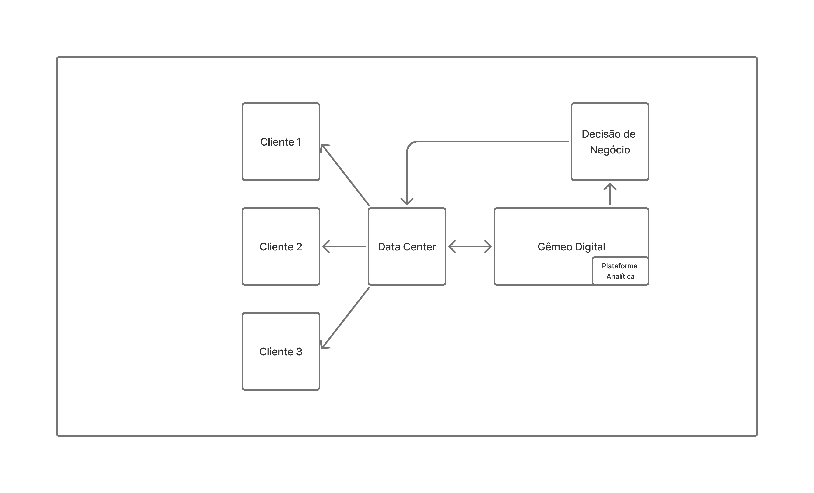
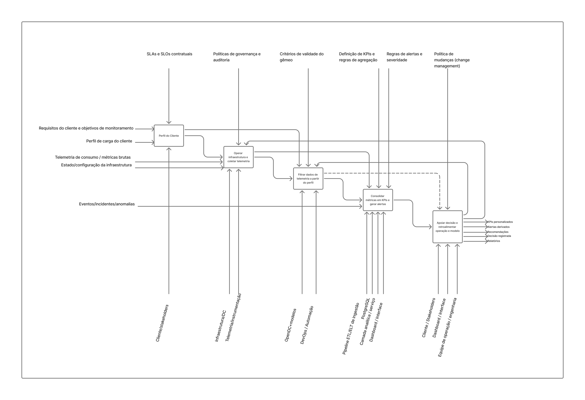

# Gêmeo Digital Adaptável ao Cliente para Monitoramento de Consumo de Recursos em Infraestrutura de Nuvem

## 1. Introdução

&emsp;Este documento registra o desenvolvimento de uma Iniciação Científica conduzida no Inteli — Instituto de Tecnologia e Liderança, sob orientação do Prof. Reginaldo Arakaki e coorientação da Prof.ª Fabiana Martins de Oliveira. O projeto investiga a concepção e implementação de um gêmeo digital adaptável para monitoramento de consumo de recursos em infraestrutura de nuvem, com foco nas dimensões de CPU, memória e energia.

### 1.1 Objetivo do Documento

&emsp;O objetivo deste documento é formalizar a estrutura conceitual, arquitetural e metodológica que orienta o repositório técnico do projeto. Para além da descrição de funcionalidades, este documento registra o processo de engenharia: a definição de requisitos, a modelagem arquitetural, a implementação incremental e os critérios de avaliação experimental.

&emsp;O percurso técnico desenvolvido compreende quatro etapas principais. Primeiro, a geração e execução de simulações no OpenDC, representando diferentes perfis operacionais de clientes. Segundo, a análise dos dados simulados com bibliotecas Python, cujos resultados e visualizações estão documentados em `analysis.md`. Terceiro, o treinamento de um modelo de recomendação sobre os dados analisados. Quarto, a integração desse modelo ao gêmeo digital, que detecta o estado da infraestrutura e entrega recomendações contextualizadas ao operador.

&emsp;Assim, este documento assegura rastreabilidade entre concepção, arquitetura e implementação, garantindo coerência técnica e reprodutibilidade ao longo do ciclo de desenvolvimento.

## 2. Entendimento do Projeto

&emsp;A premissa central deste projeto é que o valor de um sistema de monitoramento não reside apenas na coleta de métricas, mas na capacidade de interpretá-las à luz da arquitetura, das prioridades operacionais e do perfil de uso de cada organização. Ferramentas amplamente utilizadas — como AWS CloudWatch e Azure Monitor — operam com parâmetros genéricos, produzindo alertas descontextualizados que dificultam a identificação de ineficiências reais e aumentam o ruído operacional.

&emsp;Para endereçar esse problema, o projeto propõe um gêmeo digital cuja adaptabilidade é variável central do sistema: thresholds, regras de análise e modelos de custo refletem características específicas de cada cliente — como padrões de carga, sensibilidade a custos e prioridades de operação. O desenvolvimento é conduzido de forma iterativa, articulando especificação arquitetural, simulação, análise de dados e validação experimental.

### 2.1 Problema

&emsp;Organizações dependem cada vez mais de infraestrutura de nuvem para sustentar operações e serviços digitais. Entretanto, a gestão eficiente desses recursos permanece um desafio recorrente: desperdícios e superdimensionamentos podem ocorrer de maneira silenciosa, elevando custos e ampliando impactos associados ao consumo energético. Em paralelo, soluções de monitoramento amplamente utilizadas tendem a operar de modo genérico, produzindo alertas e indicadores com baixo grau de contextualização, o que dificulta distinguir sinais relevantes de eventos rotineiros e reduz a efetividade da resposta operacional.

&emsp;O problema central enfrentado por este projeto é a ausência de um mecanismo acessível e tecnicamente consistente que, além de medir consumo de CPU, memória e energia, consiga adaptar o monitoramento às características específicas de cada cliente. Essa adaptação envolve refletir diferenças de carga, prioridades estratégicas, complexidade arquitetural e políticas de operação, permitindo que o sistema reduza falsos positivos, aumente a precisão na identificação de ineficiências e forneça recomendações mais alinhadas ao contexto real de uso. Assim, o desafio não é apenas coletar dados, mas estruturar um gêmeo digital que incorpore perfis configuráveis e que possibilite avaliar, de forma contínua, como a arquitetura e os padrões de operação influenciam o consumo e as oportunidades de otimização.

## 3. Modelagem de Negócios Business Drivers

&emsp;A figura a seguir apresenta o diagrama de Business Drivers do projeto, mapeando as principais motivações de negócio que justificam o desenvolvimento do gêmeo digital adaptável. Os drivers identificados contextualizam o problema do monitoramento genérico frente às necessidades reais de organizações que operam infraestrutura de nuvem, evidenciando as forças que impulsionam a demanda por uma solução adaptável ao perfil do cliente.

 

  Figura 1 - Business Drivers   
    
  Fonte: Material produzido pelos autores (2026)  

 

## 4. Modelo de Negócios IDEF0

&emsp;A figura a seguir apresenta o modelo IDEF0 do sistema, descrevendo funcionalmente as atividades principais do gêmeo digital e as relações entre entradas, saídas, controles e mecanismos. O modelo estrutura o fluxo desde a coleta de dados de infraestrutura até a geração de recomendações, explicitando os elementos que controlam cada função e os recursos necessários para sua execução.

 

  Figura 2 - Modelo IDEF0   
    
  Fonte: Material produzido pelos autores (2026)  

 

## 5. Requisitos do Projeto

### 5.1 Requisitos Não Funcionais

#### 5.1.1 Definição dos Requisitos Não Funcionais
- Confiabilidade (e 1 SLA)
- Disponbilidade (e 1 SLA)
- Segurança (e 1 SLA)
#### 5.1.2 Táticas Arquiteturais dos Requisitos Não Funcionais

## 6. Solução Integração

&emsp;A figura a seguir apresenta o diagrama de integração do sistema, ilustrando como as três camadas do gêmeo digital se comunicam. O collector é responsável por coletar e normalizar o estado da infraestrutura — métricas de CPU, memória e energia — e encaminhá-lo à API. A API carrega o modelo de recomendação treinado, processa o estado recebido e retorna recomendações contextualizadas ao perfil do cliente. O dashboard consome essas recomendações e as exibe ao operador em tempo real via SSE.

 

  Figura 3 - Solução de Integração   
    
  Fonte: Material produzido pelos autores (2026)  

 

## 7. Componentes Serviços Legado

## 8. Modelagem de Dados

## 9. Solução Técnica (Design)

## 10. Componentes Adotados em relação as Táticas Arquiteturais

## 11. Especificação da Solução Técnica

## 12. Implementação dos Mecanismos Arquiteturais

## 13. Mapeamento Técnico de Infraestrutura e Implantação

## 14. Justificativa das Escolhas de Implantação

## 15. Considerações sobre Desempenho e Segurança
-------------------------------------------------------
--------------------------------------------

